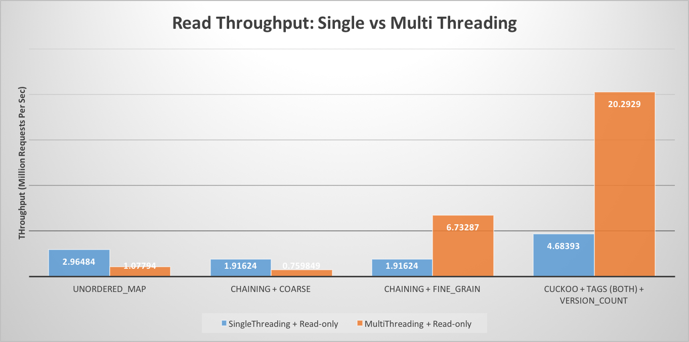

## FINAL WRITEUP

### Summary

We implemented concurrent in-memory hash table based on optimistic cuckoo hashing[1].  This hash table is optimized for high space efficiency and high read throughput. Therefore, it is best suited for read heavy workload with multiple readers and single writer use-cases. We have incorporated improvements mentioned in MemC3 by Fan et al[1], and we were able to achieve similar performance numbers (95% space efficiency and read lookup throughput of ~21 Million Ops per sec). We developed and tested our implementation on Latedays cluster (Intel Xeon CPU E5-2620).

### Overview

### Comparison of Locking Mechanism

### Impact of Tag Usage

### No. of Threads vs Throughput

### Write Percentage vs Throughput

### Read Throughput : Single vs MultiThreading

### Comparison with Reference Paper[1]

### References
[1] https://www.cs.cmu.edu/~dga/papers/memc3-nsdi2013.pdf  
[2] https://www.cs.princeton.edu/~mfreed/docs/cuckoo-eurosys14.pdf

### Work By Each Student
Equal work was performed by both project members.
