## SUMMARY

We implemented concurrent in-memory hash table based on optimistic cuckoo hashing[1].  This hash table is optimized for high space efficiency and high read throughput. Therefore, it is best suited for read heavy workload with multiple readers and single writer use-cases. We have incorporated improvements mentioned in MemC3 by Fan et al[1], and we were able to achieve similar performance numbers (95% space efficiency and read lookup throughput of ~21 Million Ops per sec). We developed and tested our implementation on Latedays cluster (Intel Xeon CPU E5-2620).

## BACKGROUND

Hash Table is a widely used data structure. In any efficient hashing scheme, collisions are frequent and chaining is the most common method to resolve collision. Chaining is efficient for insertions and deletions but is quite expensive for lookups as lookups might require traversal of the linked-list. In a multi-threading scenario, chaining with fine-grain or coarse grain locks is quite expensive. 

Previous papers show this type of locking is quite expensive in applications like MemC3[11]. There have been proposed solutions like sharding data to separate cores [4, 20, 13] but they are workload data specific. The approach described in Fan et al. [1] tries to scale performance for threads sharing the same memory space.   

The applications like MemC3 and many others have dominant read-only workload with rarely occurring writes. In these applications. The reports published by Facebook [3] show that workload is dominated by read-only queries and small-sized objects dominate. In these applications, to support multi-threading, locks are heavily used as writers can be present in the system (rare, but still possible). Hence, though most queries are reads, they get major performance hit due to obtaining locks. Even when fine-grained locking is used with chaining, obtaining locks is still a major overhead as it is highly likely that several distinct keys can map to the same bucket.

This provides us an opportunity to optimise for the common case. This approach removes all the mutexes and assumes that read-write conflict will rarely occur. It replaces locks with an optimistic hashing scheme to resolve the conflicts. It also adds other optimisations to make lookups faster and more cache-friendly (using tags). 

To implement optimistic hashing scheme, it uses cuckoo hashing  - a practical, advanced hashing scheme with high memory efficiency and O(1) expected insertion time and retrieval. The basic idea of cuckoo hashing is to use two hash functions instead of one, thus providing each key two possible locations where it can reside. Cuckoo hashing can dynamically relocate existing keys and refine the table to make room for new keys during insertion. 

Unfortunately, there are some fundamental limitations of making cuckoo hashing parallel. It does not support concurrent read/write access by default. Also, it requires multiple memory references for each insertion and lookup. A previously proposed scheme improved concurrency by trading space [12].  The hashing scheme described in this paper supports concurrent access while still maintaining the high space efficiency of cuckoo hashing (95 % in our case).

## APPROACH
To implement optimistic and concurrent hashing scheme, we add following features to overcome basic cuckoo hashing limitations. These features also make hashing scheme memory-efficient and cache-friendly. 

Optimizations added to cuckoo hashing:
- Specific hash table structure (cacheline-friendly) and optimistic version of cuckoo hashing to support multiple-reader/single writer concurrent access while preserving space benefits.
- This scheme includes: 
  A technique using a short summary of each key to improve the cache locality of hash table operations;   
  An optimization for cuckoo hashing insertion that improves throughput (by avoiding locking).

As shown in results, this hashing scheme provides significant performance boost and solid space efficiency. 
It achieves up to 95% occupancy ( which is 50% for linear probing (pigeon hole principle, birthday paradox), or needing the extra pointers required by chaining to maintain the linked list) [9].

A single lookup in a naive cuckoo hashing requires two parallel bucket reads followed by (up to) 2N (in worst case) parallel memory references if each bucket has N keys. Hashing using chaining requires up to N DEPENDENT (which can’t be done in parallel) memory references for a bucket having N keys. 

In this scheme, each lookup requires only two parallel cacheline reads followed by (up to) one memory reference on average. This approach gives a significant performance edge to read-heavy workloads.

### Hash table structure

Our hashtable’s unit structure is a slot. Each slot contains a ‘tag’ (short summary of the key, benefits of this explained in next subsection) and a pointer to key value object. Each bucket contains 4 of these slots and our hashtable is an array of these buckets.  Each key is mapped to two random buckets.

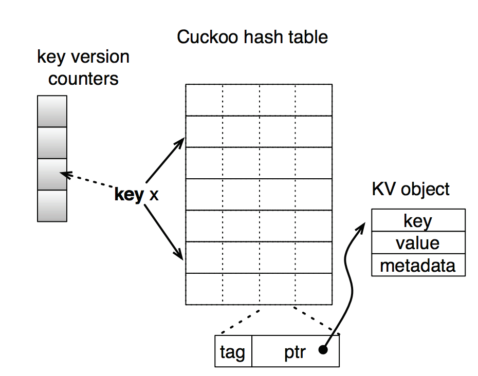

**Lookup**:

- As each key is mapped to two random buckets,  Lookup checks all 8 candidate keys from every slot.

**Insert**:
- For a key x, get two buckets b1 and b2. If any slot is empty in these buckets, simply insert the key. 
- If no empty slot is found, then we select a victim slot out of these 8 slots.
- Displace this victim slot’s key to its alternate bucket. If an empty slot is found in that bucket, simply insert the key and     displacement stops. 
- Otherwise, repeat this procedure till we find an empty slot or until a maximum displacements are performed. The entire path of displacements is called a cuckoo path. 
- Though it may execute a sequence of displacements, the expected insertion time of cuckoo hashing is O(1) [23].

### Tag based insert/lookup : (making operations cache-friendly)

In lookup, while checking all 8 candidate slots, we need to make 8 memory references to compare keys. For insert, while performing displacements along a cuckoo path, we need to access entire key to get the alternate bucket (As the buckets are determined based on hash of keys). This paper suggests an alternative to make both inserts and lookups cache-friendly (hence memory references are minimised). 

In this technique, we do not store entire key in the hash but store just “one byte hash” of the key - called “tag” in the hashtable. Now each slot has one byte cache + 8 bytes for pointer (9 bytes). Each bucket has 4 slots, which is (9*4) = 36 bytes, therefore now entire bucket easily fits in a cacheline (assuming cahceline size of 64 bytes). The basic cuckoo hashing required 8 pointer dereferences for a lookup. 

Now lookups and inserts work in following manner.
 
**Lookup**: 
- Get the buckets b1 and b2 by hashing the key.
- Calculate the tag of the key.
- Check tags stored in 8 slots with this tag.
- Check key only if tag matches. (Since tag collision in possible)

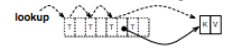

**Insert**: 
- Get bucket b1 and b2 for key.
- Try to find an empty slot among these 8 slots
- If none found, select a victim slot, start displacements until an empty slot is found.

In this Insert, next bucket is obtained based on tag stored in the victim slot. This saves us one pointer dereference every time we find next victim slot (earlier finding next bucket required accessing key). 
As a result, Insert operations never have to retrieve keys.

In this method, buckets b1 and b2 for any key x can be computed as below: 

b1 = HASH(x) // based on the entire key 

b2 = b1 ⊕ HASH(tag) // based on b1 and tag of x

Hence, given a bucket b and tag,  alternate bucket for a key can be computed as:

b’ = b ⊕ HASH(tag)

### Concurrent Access:

There are mainly three issues due to concurrent access that we need to address.
* Deadlock risk due to multiple writers (during displacements along the cuckoo path)
  - Avoided by allowing only single writer at a time
* False misses: 
  - During insert for key x, no empty slot was found. A victim slot y was selected.
  - Now we get alternate bucket z for y.
  - We replace y with x and then z with y.
  - But, after replacing y with x, and before putting y in z, key y is not present in the hashtable, hence giving a false miss to a lookup for y.
  - This problem is solved by separating search and displacement phase. 
     - First we get the entire cuckoo path without performing any replacements.
     - In second phase, we start atomic swaps from the end. 
     - This way, all keys along cuckoo path are always present in the hashtable and false misses can be avoided.
* Optimistic Locking:
  - There is still a possibility of race condition between readers and and a single writer (writer’s displacement phase moves the keys).
  - To avoid using locks, we use version counters. Each key maps to a specific index in the version counter array. More than one keys can map to same index in the version counter array.
  - Before insert modifies a key location, it atomically increments the counter in the array for that key. We use __sync_fetch_and_add() for this purpose. 
  - Once insert is done with the modification, it again increments the counter atomically.
  - Lookup checks if version counter at the index for the key is even or odd.
     - If it is odd, then insert is in the middle of the modification and hence lookup should stall.
     - If its even, then we continue.
  - Before returning, we check if the version counter has changed.
     - If yes, then we retry the lookup because this key has been modified by an insert.
     - If not, then the lookup was successful.

## RESULTS

We analyzed how various optimizations techniques contribute to the high throughput and space efficiency of our hash table’s implementation. We compared its performance with various other hash tables’ implementation, which selects different tradeoff point in design space. Finally, we compared our implementation’s performance with the performance results mentioned in reference paper [1].

### Platform

We developed and tested our implementation on Latedays cluster, which consists of Intel Xeon CPU E5-2620 v3 @ 2.40GHz, with 15 MB cache. This configuration is quite similar to the ones which were used for experiments in reference paper, which had Intel Xeon L5640 @ 2.27GHz, with 12 MB cache.

### Overall Comparison of Various Hash Table Approaches

We analyzed various hash table approaches both for single threaded and multi-threaded scenarios. Following figures demonstrate how various factors contribute towards the read throughput performance. We concluded cuckoo hash table with optimistic locking mechanism and tag byte gives the best performance for read heavy workloads. In subsequent sections we will analyze each of performance optimization in depth.

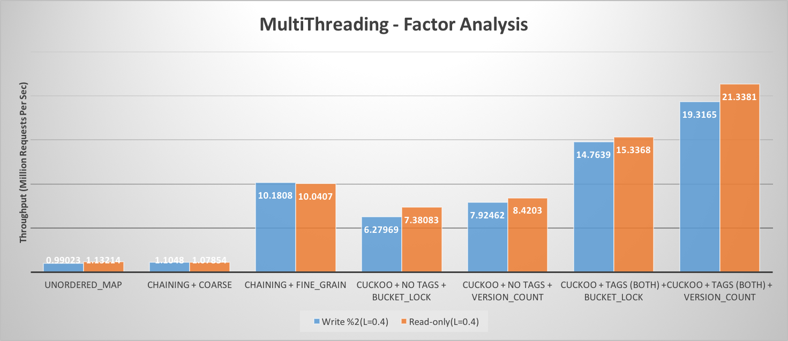

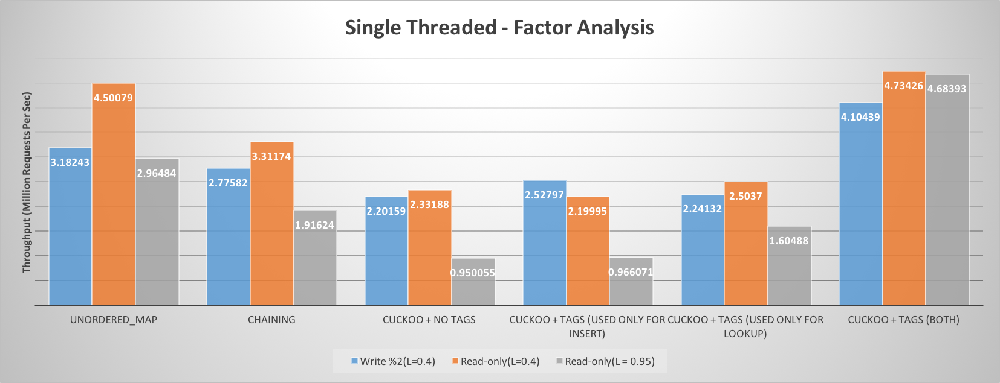

### Optimistic Locking Mechanism

We implemented two kinds of locking mechanism for cuckoo hash table. One is per bucket locking, whereas other is optimistic locking based on version counter. Optimistic locking performs significantly better than bucket based locking. It also beats chaining based hash table with coarse grain as well as fine grain locking by a big margin. As in optimistic locking, there is no need to take any kind of locks, it allows multiple concurrent reads and reduces significant overhead associated with locking. As it is meant for read heavy workload, the overhead associated with read retries during read-write conflict, doesn’t hurt much overall throughput.

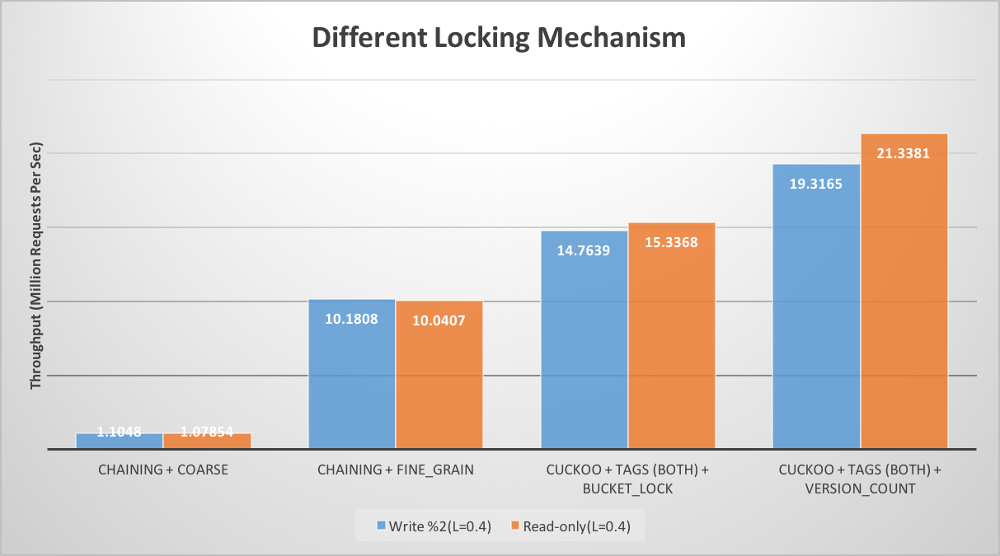

### Cache Locality Improvement Using Tag

Introduction of tag significantly boost the throughput of the hash table, both for read only as well as read-write work load, as illustrated in the figure. The main reason for this boost is cache locality. During lookup, it needs to check for the key in all the slots of both buckets. First of all, the 1-byte tag eliminates the need for fetching complete variable length key from memory for most slot checks, except when there is tag hit. As the cache size is only 1 byte, as compared to variable length key, it makes sure that complete bucket fits in a single cache line. Similarly, it helps during path search phase of insertion. Using the tag which resides in cache, instead of complete key which may reside in memory, for finding the next bucket, significantly speedup the insertion.

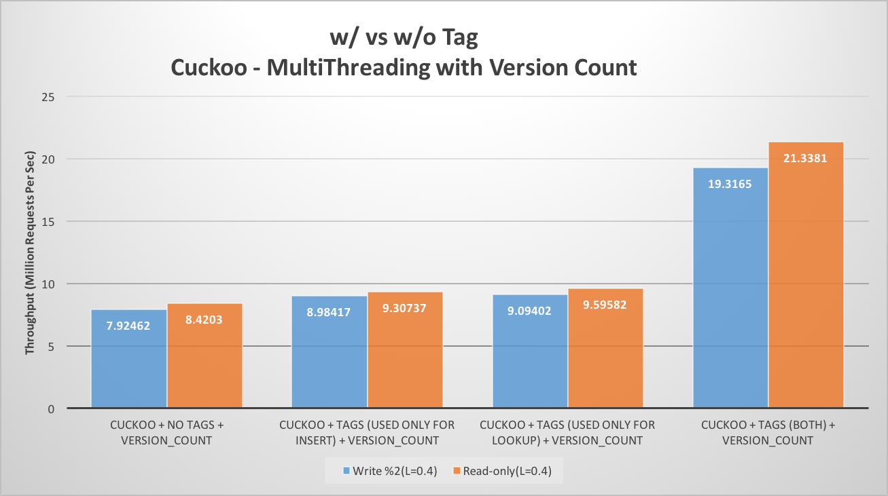

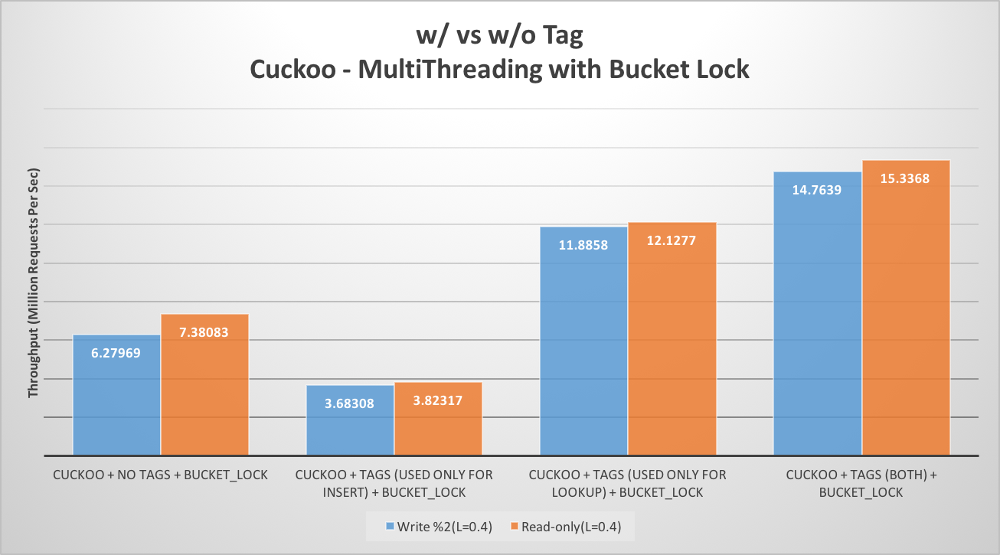

Following cache-miss statistics were obtained for an implementation of optimistic cuckoo hashing with and without tags. Cache misses were measures using *perf* tool

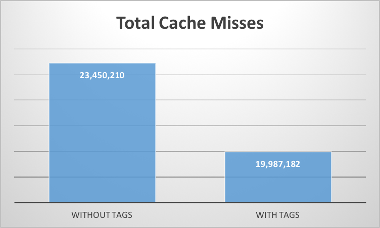

### Space Efficiency

Our cuckoo hash table was able to achieve as high occupancy as ~95%, without compromising on O (1) worst case lookup. Each key can be mapped to 2 buckets, each having 4 slots. Cuckoo path length of 500 was used as an upper bound on no. of consecutive displacements in search for an empty slot for insert, before declaring it as unsuccessful insert. 

Also, as compared to chaining based hash table, it has lower overhead for bookkeeping information. Hash table with chaining needs to store 4 or 8-bytes pointer, based on machine type, to the next item in the bucket. On the other hand, cuckoo hash table just needs to store 1-byte tag for faster lookup and inserts.

### Analysis of Write Heavy Workload

As load factor increases, the length of cuckoo path to find an empty slot increases. Therefore, insertion time gradually increases on average, with increase in occupancy of hash table. As a result, overall throughput, i.e. requests per sec, decreases with increase in percentage of write request in load, as illustrated in figure. However, as optimistic cuckoo hashing is targeted towards read heavy workload, this trade-off doesn’t hurt its performance goal significantly.

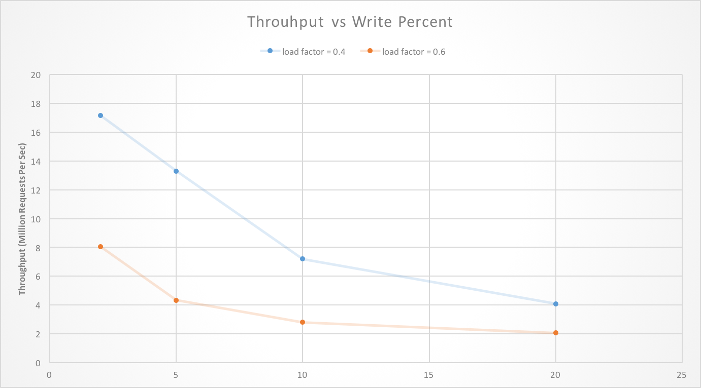

### Scalability and Threads

As number of threads increases, throughput in case of read only as read-write workload increases. As there is no lock involved in optimistic cuckoo hashing, it doesn’t suffer from issue of lock contention. For chaining based hash table with coarse grain as well as fine grain locking, throughput doesn’t increase with no. of threads. This is because operations are serialized and there is significant issue of lock contention. 

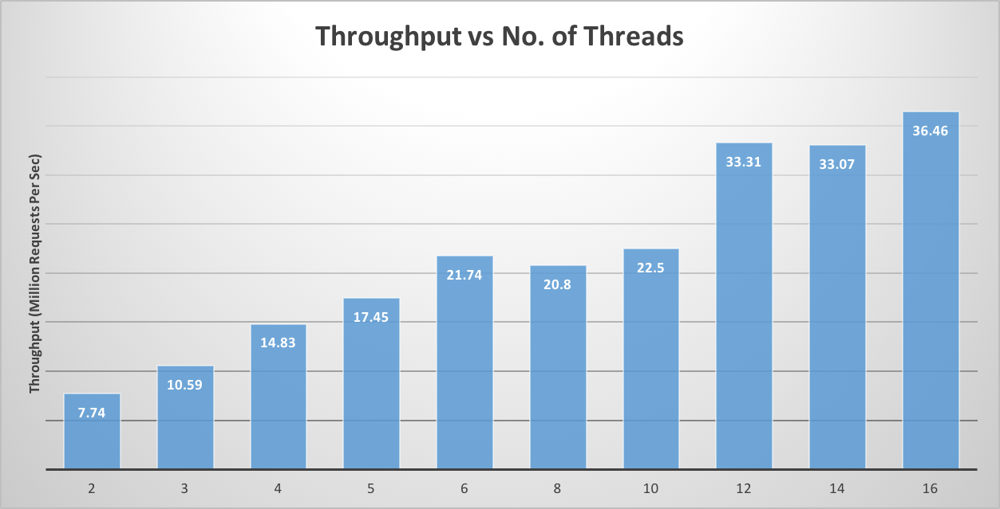

### Comparison with Reference Paper

We incorporated improvements mentioned in MemC3 by Fan et al [1], and we were able to achieve similar performance numbers, as reported in paper. As mentioned in earlier section, we tested our implementation on similar configuration as mentioned in reference paper.

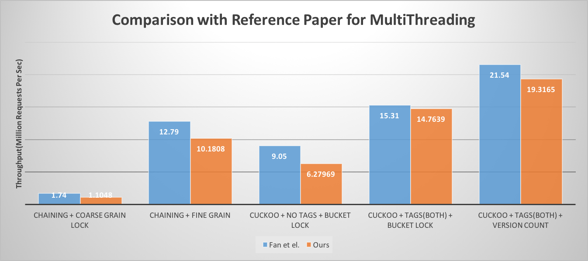

## References
[1] https://www.cs.cmu.edu/~dga/papers/memc3-nsdi2013.pdf  
[2] https://www.cs.princeton.edu/~mfreed/docs/cuckoo-eurosys14.pdf

## Work By Each Student
Equal work was performed by both project members.
